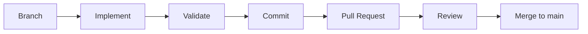

# Contributing Guidelines

This document defines the contribution workflow, validation requirements, security rules, and documentation standards for the platform repository.

---

## 1. Contribution Workflow

The repository uses a branch-based integration workflow centered on the protected `main` branch. Direct commits to `main` are strictly prohibited.



1. **Branch**: Create a focused feature branch originating from an up-to-date `main` branch.
   ```bash
   git checkout main
   git pull origin main
   git checkout -b <type>/<short-description>
   ```
2. **Implement**: Apply scoped changes. Keep changes single-purpose and update corresponding documentation when behavior, schemas, or procedures change.
3. **Validate**: Run domain-specific validation checks (Terraform, Databricks Asset Bundles, Python) locally prior to committing.
4. **Commit**: Structure commit messages following the Conventional Commits specification:
   ```text
   <type>(<scope>): <subject>
   ```
   Common types include `feat`, `fix`, `docs`, `refactor`, `test`, and `chore`.
5. **Pull Request**: Push the feature branch and open a Pull Request targeting `main`.
6. **Review**: The project owner reviews the PR for implementation quality, validation results, documentation completeness, and security compliance.
7. **Merge**: Upon successful review, the project owner merges the PR into `main`.

---

## 2. Pull Request Checklist

Every pull request must fulfill the following verification checklist before merge:

- [ ] Feature branch is created from an up-to-date `main` branch.
- [ ] Change has a clear, single-purpose scope.
- [ ] Applicable validation commands completed without errors (`terraform fmt/validate/plan`, `databricks bundle validate`, test runs).
- [ ] Documentation is updated to reflect behavior, schema, or configuration changes.
- [ ] No secrets, `.env` files, credentials, local state (`*.tfstate`), or generated build artifacts are committed.
- [ ] PR description specifies the validation performed, observed outcomes, and any operational prerequisites.

---

## 3. Validation Commands

Run the applicable validation commands before staging and committing changes.

### Infrastructure (Terraform)
All Terraform commands must be executed within the `terraform/` directory:

```bash
cd terraform
terraform fmt -check
terraform validate
terraform plan
```

*Note: Run `terraform fmt` without `-check` to automatically format configuration files.*

### Databricks Asset Bundles (DAB)
Validate bundle configurations from the repository root:

```bash
databricks bundle validate
```

### Python
| Status | Scope | Command | Description |
|---|---|---|---|
| CURRENT | Test Directory | N/A | The `tests/` directory exists but is currently empty. |
| PLANNED | Test Suite | `pytest` | Execute automated unit and integration tests once test suites are implemented. |

---

## 4. Security Rules

Platform security requires that sensitive configuration, state files, and credentials are never committed to version control.

### Prohibited Artifacts
Never commit the following items under any circumstances:
- Secrets, passwords, API tokens, IAM credentials, or private keys.
- Environment variable definition files (`.env`, `.env.*`).
- Terraform state files (`*.tfstate`, `*.tfstate.*`) and plan files (`*.tfplan`).
- Terraform variable definition files containing secrets or environment values (`*.tfvars`, `*.tfvars.json`).
- Local provider working files (`.terraform/`).
- Local data files (`data/`) or secret stores (`secrets/`).
- Build artifacts, distributions, and wheels (`dist/`, `build/`, `*.whl`).

### Ignored Paths (`.gitignore`)
The repository `.gitignore` enforces exclusion of:

| Category | Patterns Covered |
|---|---|
| Secrets & Environment | `.env`, `/secrets/` |
| Infrastructure State & Working Files | `**/.terraform/*`, `*.tfstate`, `*.tfstate.*`, `*.tfvars`, `*.tfvars.json`, `*.tfplan`, `crash.log` |
| Databricks Deployment State | `.databricks/` |
| Data Assets | `/data/`, `/project_content/` |
| Python Packaging & Caches | `/build/`, `/dist/`, `*.whl`, `*.egg-info/`, `__pycache__/`, `*.py[cod]`, `.pytest_cache/`, `.coverage` |

Verify staged files with `git status` or `git diff --staged` before creating commits.

---

## 5. Documentation

Documentation must be updated alongside code changes whenever behavior, interfaces, or configurations change.

### Update Triggers
Documentation updates are required when:
- Infrastructure resources, variables, or AWS/Databricks permissions are modified (`terraform/`).
- Databricks Asset Bundle jobs, tasks, or cluster settings change (`resources/`, `databricks.yml`).
- Pipeline scripts, package dependencies, or ingestion logic change (`src/`, `requirements.txt`).
- Development setups, validation steps, or deployment instructions are updated.

### Documentation Targets
- Platform architecture, data flow, and implementation status: [docs/architecture.md](docs/architecture.md)
- Infrastructure resources and Terraform operations: [docs/terraform.md](docs/terraform.md)
- Deployment model and DAB configuration: [docs/deployment.md](docs/deployment.md)
- Security architecture and credential management: [docs/security.md](docs/security.md)
- Repository overview and quick-start: [README.md](README.md)
