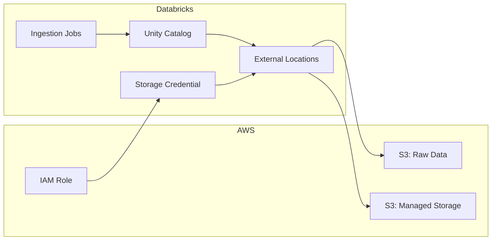

# Olist Data Platform

An ecommerce analytics platform that ingests raw transactional data from Amazon S3, processes it through a medallion lakehouse architecture on Databricks, and produces governed datasets for analytics and business intelligence.

## Architecture

**File-based (current):** `S3 → Auto Loader → Bronze (Delta) → Silver (Delta) → Gold (Delta) → Analytics / BI`

**Event-based (target — not yet implemented):** `Kafka → Structured Streaming → bronze.order_events → Silver → Gold`

All data access is governed through Databricks Unity Catalog. Infrastructure is managed by Terraform.



## Technology Stack

| Component | Technology |
|---|---|
| Cloud Provider | AWS (us-east-1) |
| Data Platform | Databricks (Unity Catalog) |
| Infrastructure | Terraform (>= 1.15.0) |
| Data Format | Delta Lake |
| Ingestion (file-based) | PySpark Structured Streaming (Auto Loader) |
| Ingestion (event-based) | PySpark Structured Streaming (Kafka) |
| Packaging | Python wheel (setuptools) |
| Deployment | Databricks Asset Bundles |
| Compute | Databricks Serverless |

## Repository Structure

```text
├── AGENTS.md                    AI agent operating guide
├── CONTRIBUTING.md              Contribution workflow and PR checklist
├── README.md                    This file
├── databricks.yml               Databricks Asset Bundle configuration
├── pyproject.toml               Python package definition
├── terraform/                   AWS and Databricks infrastructure (Terraform)
│   ├── aws_s3.tf                S3 buckets and security
│   ├── iam.tf                   IAM role and policy
│   ├── databricks_storage.tf    Storage credential
│   ├── databricks_external_location.tf   External locations
│   ├── catalog.tf               Unity Catalog catalogs
│   ├── schemas.tf               Medallion schemas
│   ├── providers.tf             Provider configuration
│   ├── variables.tf             Input variables
│   └── versions.tf              Version constraints
├── src/
│   ├── ingestion/               Reusable data processing modules
│   │   └── ingestion.py         Auto Loader bronze ingestion
│   └── jobs/                    Databricks job entry points
│       └── bronze_ingestion.py  Bronze ingestion job CLI
├── resources/
│   └── bronze_job.yml           Bronze ingestion job definition
├── tests/                       Automated tests (placeholder)
├── data/raw/                    Local sample data (gitignored)
├── docs/                        Platform documentation
│   ├── architecture.md          Platform architecture and implementation status
│   ├── deployment.md            DAB deployment model and Python packaging
│   ├── security.md              Security architecture and credential management
│   └── terraform.md             Terraform resource inventory and operations
└── notebooks/                   Exploratory notebooks (empty)
```

## Data Flow

The platform processes the **Olist Brazilian E-Commerce dataset** through a medallion architecture:

| Layer | Schema | Description | Status |
|---|---|---|---|
| Raw (S3 — file-based) | `s3://olist-data-platform-raw/raw/olist/<dataset>/` | CSV files per dataset; `historical/` and `incoming/` prefixes | **Planned** — target layout defined; data not yet uploaded |
| Bronze (file-based) | `<catalog>.bronze.*` | Delta tables for orders, customers, products, sellers, order_items, payments, reviews, geolocation, category_translation — ingested via Auto Loader | **Current** — code implemented, awaiting data |
| Bronze (event-based) | `<catalog>.bronze.order_events` | Real-time order events from Kafka via Structured Streaming | **Target** — not yet implemented |
| Silver | `<catalog>.silver` | Cleaned, conformed, and reconciled tables | **Planned** |
| Gold | `<catalog>.gold` | Business-level aggregate models | **Planned** |

## Environment Model

| Environment | Catalog | Purpose |
|---|---|---|
| Development | `01_ecommerce_dev` | Active development and testing |
| Staging | `02_ecommerce_stg` | Pre-production validation |
| Production | `03_ecommerce_prod` | Production workloads |

## Prerequisites

- [Terraform](https://developer.hashicorp.com/terraform/install) >= 1.15.0
- [Databricks CLI](https://docs.databricks.com/dev-tools/cli/install.html) with bundle support
- Python >= 3.10
- AWS credentials configured (via environment variables)
- Databricks workspace credentials (via `DATABRICKS_HOST` and `DATABRICKS_TOKEN`)

## Local Setup

1. Clone the repository.
2. Create a `.env` file (gitignored) with credentials:
   ```dotenv
   DATABRICKS_HOST=https://<workspace-url>
   DATABRICKS_TOKEN=<personal-access-token>
   AWS_ACCESS_KEY_ID=<key>
   AWS_SECRET_ACCESS_KEY=<secret>
   AWS_DEFAULT_REGION=us-east-1
   ```
3. Load environment variables into your shell session.

## Validate and Deploy

### Terraform

```bash
cd terraform
terraform init          # Initialize providers (first time)
terraform fmt           # Format configuration
terraform validate      # Validate syntax and references
terraform plan          # Preview changes
terraform apply         # Apply (after plan review)
```

### Databricks Asset Bundle

```bash
# From repository root
databricks bundle validate          # Validate bundle configuration
databricks bundle deploy            # Deploy to Databricks
databricks bundle run bronze_ingestion   # Run the bronze ingestion job
```

### Python Package Build

```bash
python -m build         # Build wheel artifact in dist/
```

## Testing

```bash
pytest                  # Run tests (tests/ directory — currently empty)
```

## Security Model

All data access flows through a governed chain:

```text
Databricks Job → Unity Catalog External Location → Storage Credential → IAM Role → S3
```

Key protections:
- S3 buckets: public access blocked, AES-256 encryption, versioning enabled
- Unity Catalog governance for all data access
- No credentials committed to version control
- Terraform state is local and gitignored

See [docs/security.md](docs/security.md) for the full security architecture.

## Documentation

| Document | Purpose |
|---|---|
| [AGENTS.md](AGENTS.md) | AI agent operating guide and engineering contract |
| [docs/architecture.md](docs/architecture.md) | Platform architecture, data flow, implementation status |
| [docs/deployment.md](docs/deployment.md) | DAB deployment model, Python packaging, job definitions |
| [docs/security.md](docs/security.md) | Security architecture, IAM, credential management |
| [docs/terraform.md](docs/terraform.md) | Terraform resource inventory, variables, operations |
| [CONTRIBUTING.md](CONTRIBUTING.md) | Contribution workflow, PR checklist, validation |
