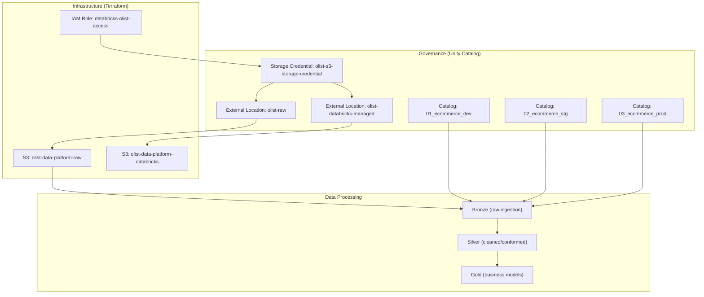

# Architecture

The Olist Data Platform is an ecommerce analytics platform that ingests raw transactional data from Amazon S3, processes it through a medallion lakehouse architecture on Databricks, and produces governed datasets for analytics and business intelligence.

## Platform Architecture



## Technology Stack

| Layer | Technology | Purpose |
|---|---|---|
| Cloud Provider | AWS (us-east-1) | S3 storage, IAM access control |
| Data Platform | Databricks | Compute, Unity Catalog, job orchestration |
| Infrastructure as Code | Terraform (>= 1.15.0) | AWS and Databricks resource management |
| Data Format | Delta Lake | ACID-compliant table storage |
| Ingestion | PySpark Structured Streaming (Auto Loader) | CSV-to-Delta bronze ingestion |
| Packaging | Python (setuptools, wheel) | Reusable code distribution |
| Deployment | Databricks Asset Bundles (DAB) | Job definition, artifact packaging, deployment |
| Governance | Unity Catalog | Catalog/schema/table-level access control |

## Data Domain

The platform processes the **Olist Brazilian E-Commerce dataset**, which contains:
- Orders, order items, order payments, order reviews
- Customers, sellers, products
- Geolocation data
- Product category translations

Raw CSV files are stored locally in `data/raw/` (gitignored). These files have not yet been uploaded to the governed S3 raw-data location.

## Data Flow

```text
Source CSV files
    ↓
S3: olist-data-platform-raw/raw/olist/
    ↓
Auto Loader (cloudFiles) — Spark Structured Streaming
    ↓
Bronze Delta tables (01_ecommerce_dev.bronze.*)
    ↓ [Planned]
Silver Delta tables (cleaned, conformed)
    ↓ [Planned]
Gold Delta tables (business models)
    ↓ [Planned]
Analytics / BI
```

**Current**: Bronze ingestion code is implemented. Raw data has not yet been uploaded to S3.

**Planned**: Silver transformations, gold business models, data quality, orchestration.

## Environment Model

| Environment | Catalog | Purpose |
|---|---|---|
| Development | `01_ecommerce_dev` | Active development and testing |
| Staging | `02_ecommerce_stg` | Pre-production validation |
| Production | `03_ecommerce_prod` | Production workloads |

Each catalog contains three medallion schemas: `bronze`, `silver`, `gold`.

All catalogs store managed data under `s3://olist-data-platform-databricks/catalogue/<catalog_name>`.

## S3 Bucket Design

| Bucket | Purpose | External Location |
|---|---|---|
| `olist-data-platform-raw` | Raw source data landing zone | `olist-raw` → `s3://…/raw/` |
| `olist-data-platform-databricks` | Databricks managed storage (catalogs, checkpoints, schemas) | `olist-databricks-managed` → `s3://…/catalogue/` |

Both buckets have public access blocking, AES-256 encryption, and versioning enabled. See [security.md](security.md).

## Access Architecture

```text
Databricks Job
    ↓
Unity Catalog External Location
    ↓
Storage Credential (olist-s3-storage-credential)
    ↓
AWS IAM Role (databricks-olist-access)
    ↓
S3 Buckets
```

All data access flows through Unity Catalog governance. Direct S3 access bypassing Unity Catalog is not permitted. See [security.md](security.md) for the full security model.

## Code Architecture

### Pipeline: Source → Package → Deployment → Execution

```text
src/ingestion/          Reusable Python modules (application logic)
    ↓
src/jobs/               Job entry points (CLI wrappers)
    ↓
pyproject.toml          Package definition (setuptools)
    ↓
python -m build         Build wheel artifact
    ↓
dist/*.whl              Distributable package
    ↓
databricks.yml          Bundle artifact definition
    ↓
resources/*.yml         Job definitions referencing wheel
    ↓
databricks bundle deploy    Deploy to Databricks
    ↓
Serverless environment      Execute job
    ↓
Delta tables                Write to Unity Catalog
```

### Module Responsibilities

| Directory | Role | Convention |
|---|---|---|
| `src/ingestion/` | Reusable data processing modules | Importable functions with explicit parameters; no CLI logic |
| `src/jobs/` | Databricks job entry points | Parse arguments, invoke reusable modules, manage execution lifecycle |

New reusable logic should be added as packages under `src/`. Job entry points under `src/jobs/` should remain thin wrappers. See [deployment.md](deployment.md) for packaging and deployment details.

## Infrastructure

Terraform manages 25 resource instances across AWS and Databricks. The configuration is intentionally root-level without modules. See [terraform.md](terraform.md) for the complete resource inventory and operational procedures.

## Implementation Status

| Component | Status | Notes |
|---|---|---|
| S3 buckets and security | **Current** | Two buckets with full security configuration |
| IAM role and policy | **Current** | Broad `s3:*` permissions — requires narrowing |
| Storage credential | **Current** | Unity Catalog credential backed by IAM role |
| External locations | **Current** | Raw and managed storage locations registered |
| Unity Catalog catalogs | **Current** | Three environment catalogs |
| Medallion schemas | **Current** | Bronze, silver, gold per catalog |
| Bronze ingestion code | **Current** | Auto Loader implementation in `src/ingestion/` |
| DAB job definition | **Current** | `resources/bronze_job.yml` with wheel packaging |
| Python wheel packaging | **Current** | `pyproject.toml` with setuptools backend |
| Unity Catalog grants | **Planned** | Least-privilege grants not yet defined |
| IAM policy narrowing | **Planned** | `s3:*` needs reduction to required actions |
| Raw data upload to S3 | **Planned** | Local CSV files exist; not yet uploaded |
| Silver transformations | **Planned** | No implementation |
| Gold business models | **Planned** | No implementation |
| Data quality framework | **Planned** | No implementation |
| CI/CD pipeline | **Planned** | No implementation |
| Remote Terraform state | **Planned** | Currently local |
| Orchestration | **Planned** | No implementation |

## Architecture Decisions

| Decision | Rationale |
|---|---|
| Root-level Terraform (no modules) | Keeps infrastructure configuration transparent and directly inspectable |
| Separate raw and managed-storage S3 buckets | Isolates source landing data from Databricks catalog storage |
| Three environment catalogs | Provides dev/stg/prod isolation at the Unity Catalog level |
| Medallion schemas per catalog | Consistent bronze/silver/gold topology across environments |
| Governance before ingestion | Ensures all data access patterns are governed from the start |
| Python wheel packaging | Enables reusable code distribution to serverless Databricks jobs |
| Thin job entry points | Separates CLI/argument handling from reusable application logic |
| Auto Loader for ingestion | Provides incremental file processing with schema inference and exactly-once semantics |

## Related Documentation

- [Terraform Infrastructure](terraform.md) — resource inventory, variables, validation workflow
- [Deployment](deployment.md) — DAB configuration, packaging, deployment commands
- [Security](security.md) — access architecture, IAM, credential management
