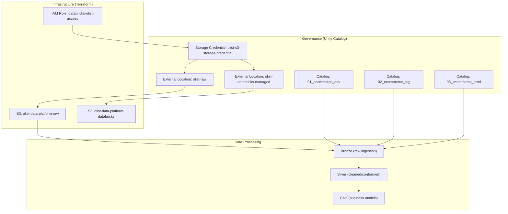

# Architecture

The Olist Data Platform is an ecommerce analytics platform that ingests raw transactional data from Amazon S3, processes it through a medallion lakehouse architecture on Databricks, and produces governed datasets for analytics and business intelligence.

## Platform Architecture



## Technology Stack

| Layer | Technology | Purpose |
|---|---|---|
| Cloud Provider | AWS (us-east-1) | S3 storage, IAM access control |
| Data Platform | Databricks | Compute, Unity Catalog, job orchestration |
| Infrastructure as Code | Terraform (>= 1.15.0) | AWS and Databricks resource management |
| Data Format | Delta Lake | ACID-compliant table storage |
| File-based Ingestion | PySpark Structured Streaming (Auto Loader) | S3 CSV-to-Delta bronze ingestion (current) |
| Event-based Ingestion | PySpark Structured Streaming (Kafka) | Real-time order events to bronze (target — not yet implemented) |
| Packaging | Python (setuptools, wheel) | Reusable code distribution |
| Deployment | Databricks Asset Bundles (DAB) | Job definition, artifact packaging, deployment |
| Governance | Unity Catalog | Catalog/schema/table-level access control |

## Data Domain and Source Systems

The platform processes the **Olist Brazilian E-Commerce dataset**. Source data arrives through two ingestion paths.

### System Boundary

> [!IMPORTANT]
> This repository implements the **data platform only**. It consumes data from external source systems and must not contain source-data generation or simulation logic.
>
> A separate **Olist Data Generator** repository will simulate upstream source systems (file drops to S3, Kafka event production). That repository can evolve independently and is not part of this codebase.

### File-based Sources (S3 → Auto Loader)

Historical and incremental reference/master data arrives as CSV files in the governed S3 raw bucket. These datasets are ingested by Databricks Auto Loader:

| Dataset | Bronze Table | Notes |
|---|---|---|
| Orders (historical) | `bronze.orders` | Initial historical snapshot; new order activity arrives via Kafka (target) |
| Customers | `bronze.customers` | Master data |
| Products | `bronze.products` | Master data |
| Sellers | `bronze.sellers` | Master data |
| Order items | `bronze.order_items` | Transaction detail |
| Order payments | `bronze.payments` | Transaction detail |
| Order reviews | `bronze.reviews` | Transaction detail |
| Geolocation | `bronze.geolocation` | Reference data |
| Category translation | `bronze.category_translation` | Reference data |

### Event-based Sources (Kafka → Structured Streaming) — Target

> [!NOTE]
> **Target / Future State — not yet implemented.** Kafka integration is a planned capability. No Kafka infrastructure or streaming consumer code exists in this repository today.

New order activity is modelled as real-time events produced by an upstream source system to a Kafka topic. Databricks Structured Streaming will consume these events and land them in `bronze.order_events`. Silver is responsible for reconciling historical file-based order data with streaming order events into clean business entities.

## Ingestion Architecture (Target)

```text
                       OLIST SOURCES
                            │
            ┌───────────────┴───────────────┐
            │                               │
        File-based                       Event-based
            │                         (Target — not yet implemented)
            ▼                               ▼
           S3                             Kafka
            │                               │
            │                         order events
            │                               │
      Auto Loader                    Structured Streaming
            │                               │
            ▼                               ▼
      bronze.orders              bronze.order_events [Target]
      bronze.customers
      bronze.products
      bronze.sellers
      bronze.order_items
      bronze.payments
      bronze.reviews
      bronze.geolocation
      bronze.category_translation
            │                               │
            └───────────────┬───────────────┘
                            ▼
                         SILVER
                            │
                            ▼
                          GOLD
```

## Data Flow

### Current State

```text
Source CSV files (local data/raw/ — not yet uploaded)
    ↓
S3: olist-data-platform-raw/raw/olist/<dataset>/
    ↓
Auto Loader (cloudFiles) — Spark Structured Streaming
    ↓
Bronze Delta tables (<catalog>.bronze.*)
    ↓ [Planned]
Silver Delta tables (cleaned, conformed)
    ↓ [Planned]
Gold Delta tables (business models)
    ↓ [Planned]
Analytics / BI
```

**Current**: Bronze ingestion code (Auto Loader) is implemented. Raw data has not yet been uploaded to S3.

### Target State (Kafka path — not yet implemented)

```text
Kafka topic (order events)
    ↓
Databricks Structured Streaming consumer
    ↓
bronze.order_events (Delta)
    ↓ [Planned]
Silver (reconcile with file-based historical data)
```

## S3 Source Layout (Target)

> [!NOTE]
> **Target source contract — not yet implemented.** This is the intended S3 prefix organization for the raw landing zone. The actual prefix structure will be established when raw data is loaded.

```text
s3://olist-data-platform-raw/
└── raw/
    └── olist/
        ├── orders/
        │   ├── historical/
        │   └── incoming/
        │
        ├── customers/
        │   ├── historical/
        │   └── incoming/
        │
        ├── products/
        │   ├── historical/
        │   └── incoming/
        │
        ├── order_items/
        │   ├── historical/
        │   └── incoming/
        │
        ├── order_payments/
        │   ├── historical/
        │   └── incoming/
        │
        ├── order_reviews/
        │   ├── historical/
        │   └── incoming/
        │
        ├── sellers/
        │   ├── historical/
        │   └── incoming/
        │
        ├── geolocation/
        │   ├── historical/
        │   └── incoming/
        │
        └── category_translation/
            ├── historical/
            └── incoming/
```

Each dataset has a `historical/` prefix for the initial bulk load and an `incoming/` prefix for subsequent incremental arrivals. The ingestion architecture is designed to support incremental processing of incoming files.

## Environment Model

| Environment | Catalog | Purpose |
|---|---|---|
| Development | `01_ecommerce_dev` | Active development and testing |
| Staging | `02_ecommerce_stg` | Pre-production validation |
| Production | `03_ecommerce_prod` | Production workloads |

Each catalog contains three medallion schemas: `bronze`, `silver`, `gold`.

All catalogs store managed data under `s3://olist-data-platform-databricks/catalogue/<catalog_name>`.

## S3 Bucket Design

| Bucket | Purpose | External Location |
|---|---|---|
| `olist-data-platform-raw` | Raw source data landing zone | `olist-raw` → `s3://…/raw/` |
| `olist-data-platform-databricks` | Databricks managed storage (catalogs, checkpoints, schemas) | `olist-databricks-managed` → `s3://…/catalogue/` |

Both buckets have public access blocking, AES-256 encryption, and versioning enabled. See [security.md](security.md).

## Access Architecture

```text
Databricks Job
    ↓
Unity Catalog External Location
    ↓
Storage Credential (olist-s3-storage-credential)
    ↓
AWS IAM Role (databricks-olist-access)
    ↓
S3 Buckets
```

All data access flows through Unity Catalog governance. Direct S3 access bypassing Unity Catalog is not permitted. See [security.md](security.md) for the full security model.

## Code Architecture

### Pipeline: Source → Package → Deployment → Execution

```text
src/ingestion/          Reusable Python modules (application logic)
    ↓
src/jobs/               Job entry points (CLI wrappers)
    ↓
pyproject.toml          Package definition (setuptools)
    ↓
python -m build         Build wheel artifact
    ↓
dist/*.whl              Distributable package
    ↓
databricks.yml          Bundle artifact definition
    ↓
resources/*.yml         Job definitions referencing wheel
    ↓
databricks bundle deploy    Deploy to Databricks
    ↓
Serverless environment      Execute job
    ↓
Delta tables                Write to Unity Catalog
```

### Module Responsibilities

| Directory | Role | Convention |
|---|---|---|
| `src/ingestion/` | Reusable data processing modules | Importable functions with explicit parameters; no CLI logic |
| `src/jobs/` | Databricks job entry points | Parse arguments, invoke reusable modules, manage execution lifecycle |

New reusable logic should be added as packages under `src/`. Job entry points under `src/jobs/` should remain thin wrappers. See [deployment.md](deployment.md) for packaging and deployment details.

## Infrastructure

Terraform manages 25 resource instances across AWS and Databricks. The configuration is intentionally root-level without modules. See [terraform.md](terraform.md) for the complete resource inventory and operational procedures.

## Implementation Status

| Component | Status | Notes |
|---|---|---|
| S3 buckets and security | **Current** | Two buckets with full security configuration |
| IAM role and policy | **Current** | Broad `s3:*` permissions — requires narrowing |
| Storage credential | **Current** | Unity Catalog credential backed by IAM role |
| External locations | **Current** | Raw and managed storage locations registered |
| Unity Catalog catalogs | **Current** | Three environment catalogs |
| Medallion schemas | **Current** | Bronze, silver, gold per catalog |
| Bronze ingestion code (Auto Loader) | **Current** | `src/ingestion/` implements `ingest_to_bronze()` for file-based S3 data |
| DAB job definition | **Current** | `resources/bronze_job.yml` with wheel packaging |
| Python wheel packaging | **Current** | `pyproject.toml` with setuptools backend |
| Raw data upload to S3 | **Planned** | Local CSV files exist in `data/raw/`; not yet uploaded |
| S3 source prefix layout | **Planned** | Target layout defined above; not yet created |
| Unity Catalog grants | **Planned** | Least-privilege grants not yet defined |
| IAM policy narrowing | **Planned** | `s3:*` needs reduction to required actions |
| Silver transformations | **Planned** | No implementation |
| Gold business models | **Planned** | No implementation |
| Kafka infrastructure | **Planned** | No Kafka cluster or topic provisioned |
| Structured Streaming (Kafka consumer) | **Planned** | No implementation; `bronze.order_events` does not exist yet |
| Data Generator repository | **Planned** | Separate repository to simulate upstream source systems |
| Data quality framework | **Planned** | No implementation |
| CI/CD pipeline | **Planned** | No implementation |
| Remote Terraform state | **Planned** | Currently local |
| Orchestration | **Planned** | No implementation |

## Architecture Decisions

| Decision | Rationale |
|---|---|
| Root-level Terraform (no modules) | Keeps infrastructure configuration transparent and directly inspectable |
| Separate raw and managed-storage S3 buckets | Isolates source landing data from Databricks catalog storage |
| Three environment catalogs | Provides dev/stg/prod isolation at the Unity Catalog level |
| Medallion schemas per catalog | Consistent bronze/silver/gold topology across environments |
| Governance before ingestion | Ensures all data access patterns are governed from the start |
| Python wheel packaging | Enables reusable code distribution to serverless Databricks jobs |
| Thin job entry points | Separates CLI/argument handling from reusable application logic |
| Auto Loader for file-based ingestion | Provides incremental file processing with schema inference and exactly-once semantics |
| Kafka + Structured Streaming for event-based ingestion | Decouples real-time order events from batch file arrivals; events land in `bronze.order_events` (target) |
| `bronze.order_events` instead of merging into `bronze.orders` | Preserves the raw event structure; Silver reconciles file-based historical data with streaming events |
| Separate Data Generator repository | Keeps source-simulation logic out of the production data platform; allows independent evolution |
| `historical/` and `incoming/` S3 prefixes per dataset | Distinguishes initial bulk loads from incremental file arrivals within the same dataset prefix |

## Related Documentation

- [Terraform Infrastructure](terraform.md) — resource inventory, variables, validation workflow
- [Deployment](deployment.md) — DAB configuration, packaging, deployment commands
- [Security](security.md) — access architecture, IAM, credential management
