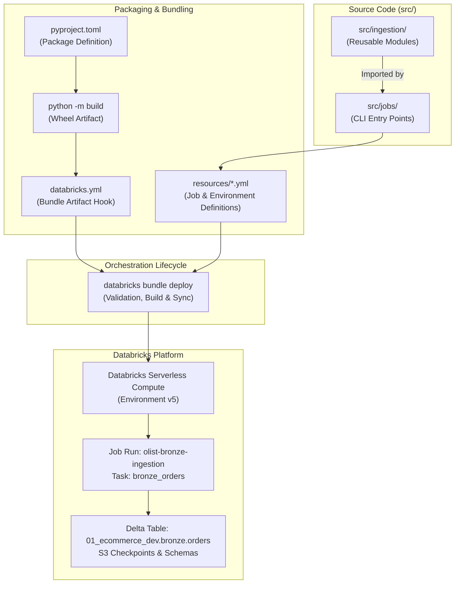

# Databricks Deployment Model

This document specifies the deployment architecture, packaging model, and workflow automation for the Databricks platform using Databricks Asset Bundles (DABs).

For infrastructure and storage provisioning, refer to [terraform.md](terraform.md). For end-to-end data platform design and identity controls, refer to [architecture.md](architecture.md) and [security.md](security.md).

---

## 1. Overview

The data platform utilizes **Databricks Asset Bundles (DABs)** to define, package, test, and deploy data pipelines as code. DABs provide declarative resource definitions (YAML), environment-specific targets, automated build lifecycle hooks, and continuous integration capabilities.

Key architectural characteristics:
- **Declarative Infrastructure as Code for Workflows**: Job workflows, task graphs, compute environments, and schedules are versioned in source control under `resources/`.
- **Decoupled Code & Orchestration**: Reusable business and ingestion logic is packaged into standard Python wheels (`.whl`), while thin CLI scripts serve as task entry points.
- **Serverless Execution**: Workflows run on Databricks Serverless compute environments, eliminating manual cluster management and reducing startup latency.
- **Target Isolation**: Target configurations isolate development workspace deployments (`dev`) from staging and production.

---

## 2. Python Packaging

Pipeline logic is structured and distributed as a standard Python package using `setuptools`.

### Build System & Metadata (`pyproject.toml`)

The package is declared with declarative configuration in `pyproject.toml`:

```toml
[build-system]
requires = ["setuptools>=61"]
build-backend = "setuptools.build_meta"

[project]
name = "olist-ecommerce-platform"
version = "0.1.0"
description = "Olist ecommerce data engineering platform"
requires-python = ">=3.10"

[tool.setuptools.packages.find]
where = ["src"]
```

### Source Code Layout

The codebase enforces a strict separation between reusable modules and execution entry points:

```text
src/
├── ingestion/
│   ├── __init__.py          # Reusable module exports
│   └── ingestion.py         # Core ingestion engine (ingest_to_bronze)
└── jobs/
    └── bronze_ingestion.py  # CLI entry point (argparse invocation)
```

| Layer | Path | Responsibility | Packaging Behavior |
|---|---|---|---|
| **Reusable Modules** | `src/ingestion/` | Business logic, Spark Structured Streaming pipelines, Auto Loader integration, Delta transformations. | Built into wheel distribution; installed as cluster/environment library. |
| **Job Entry Points** | `src/jobs/` | CLI parsing (`argparse`), environment parameter ingestion, function orchestration, stream termination control. | Executed directly as `spark_python_task` files in Databricks tasks. |

### Module Implementation Details

- **`src/ingestion/ingestion.py`**: Exports `ingest_to_bronze(spark, source_path, checkpoint_path, schema_path, target_table)`.
  - Implements **Spark Structured Streaming** using Databricks Auto Loader (`format("cloudFiles")`).
  - Configures CSV ingestion with `cloudFiles.format = "csv"`, header evaluation (`header = true`), and automatic schema inference (`cloudFiles.inferColumnTypes = true`).
  - Preserves schema evolution history at `schema_path`.
  - Enforces exactly-once stream processing guarantees via persistent checkpointing at `checkpoint_path`.
  - Writes to Delta Lake (`format("delta")`) using the `trigger(availableNow=True)` micro-batch execution model.
- **`src/jobs/bronze_ingestion.py`**: CLI wrapper accepting `--source-path`, `--checkpoint-path`, `--schema-path`, and `--target-table`.
  - Consumes the globally provided `spark` session managed by the Databricks notebook/serverless runtime context.
  - Calls `ingest_to_bronze(...)` and invokes `query.awaitTermination()` to block task execution until the micro-batch stream finishes.

### Wheel Build & Distribution

- The wheel package is compiled using `python -m build`.
- Build artifacts (`build/`, `dist/`, `*.egg-info/`, `*.whl`) are gitignored in repository root `.gitignore`.
- Build output is picked up by DAB bundle definitions from `dist/*.whl` during deployment.

---

## 3. Databricks Asset Bundle (DAB) Configuration

The repository root configuration file `databricks.yml` governs bundle identity, build hooks, external resource inclusions, and deployment targets:

```yaml
bundle:
  name: olist_ecommerce_platform

include:
  - resources/*.yml

artifacts:
  default:
    type: whl
    build: python -m build

targets:
  dev:
    mode: development
    default: true
```

### Bundle Specification

| Key | Value | Purpose |
|---|---|---|
| `bundle.name` | `olist_ecommerce_platform` | Logical identifier for the asset bundle within the workspace. |
| `include` | `resources/*.yml` | Glob pattern matching all modular job and pipeline definitions. |
| `artifacts.default` | `type: whl`, `build: python -m build` | Triggers wheel compilation on `bundle deploy` or `bundle run` prior to artifact staging. |
| `targets.dev` | `mode: development`, `default: true` | Default deployment target. Applies developer isolation rules (namespacing deployed jobs and temporary files). |

---

## 4. Job Definitions

Workflow definitions reside under `resources/`. The bronze tier ingestion job is declared in `resources/bronze_job.yml`:

```yaml
resources:
  jobs:
    bronze_ingestion:
      name: olist-bronze-ingestion

      tasks:
        - task_key: bronze_orders

          spark_python_task:
            python_file: ../src/jobs/bronze_ingestion.py
            parameters:
              - "--source-path"
              - "s3://olist-data-platform-raw/raw/olist/"
              - "--checkpoint-path"
              - "s3://olist-data-platform-databricks/catalogue/checkpoints/bronze/orders/"
              - "--schema-path"
              - "s3://olist-data-platform-databricks/catalogue/schemas/bronze/orders/"
              - "--target-table"
              - "01_ecommerce_dev.bronze.orders"
          libraries:
            - whl: ../dist/*.whl

          environment_key: default

      environments:
        - environment_key: default
          spec:
            environment_version: "5"
```

### Job Task & Runtime Specification

| Configuration Key | Value | Operational Details |
|---|---|---|
| `jobs.bronze_ingestion.name` | `olist-bronze-ingestion` | Workspace display name for the job. |
| `tasks[].task_key` | `bronze_orders` | Unique task identifier within the job graph. |
| `spark_python_task.python_file` | `../src/jobs/bronze_ingestion.py` | Task entry point script. Relative to `resources/`. |
| `spark_python_task.parameters` | CLI flags | Sets S3 source path, S3 checkpoint path, S3 schema tracking path, and Unity Catalog target table. |
| `libraries` | `../dist/*.whl` | Installs compiled platform wheel into the task execution environment. |
| `environment_key` | `default` | Binds task to the configured serverless runtime environment. |
| `spec.environment_version` | `"5"` | Databricks Serverless Environment version. |

---

## 5. Code Architecture

The following diagram illustrates the relationship from source modules to Databricks serverless runtime execution:



### Artifact and Execution Data Flow

1. **Module Import**: `src/jobs/bronze_ingestion.py` imports `ingest_to_bronze` from `ingestion.ingestion`.
2. **Packaging**: `pyproject.toml` defines package discovery for `src/`. Running `python -m build` compiles `olist_ecommerce_platform-0.1.0-py3-none-any.whl` into `dist/`.
3. **Bundle Registration**: `databricks.yml` invokes the build hook and tracks `resources/*.yml`.
4. **Deployment**: `databricks bundle deploy` builds the wheel, uploads it to workspace storage, validates schema references, and updates the workspace job.
5. **Execution**: Databricks serverless compute provisions environment version `5`, installs the wheel dependency, executes the entry point with CLI parameters, and processes incoming records into the target Delta table.

---

## 6. Deployment Commands

All bundle operations are executed from the repository root via the Databricks CLI.

```bash
# Validate bundle configuration, syntax, and resource definitions
databricks bundle validate

# Validate against a specific target environment
databricks bundle validate -t dev

# Build artifacts, sync files, and deploy jobs to target workspace
databricks bundle deploy

# Deploy explicitly to dev target
databricks bundle deploy -t dev

# Trigger execution of deployed job
databricks bundle run bronze_ingestion

# Trigger run on specific target
databricks bundle run -t dev bronze_ingestion
```

### Command Lifecycle Behavior

| Command | Action |
|---|---|
| `validate` | Checks bundle syntax against workspace schema, verifies variable substitutions, tests file references, and ensures valid resource structure. Does not mutate workspace state. |
| `deploy` | Runs artifact build command (`python -m build`), synchronizes code and wheel files to workspace root, creates/updates job definitions in Databricks Workflows. |
| `run` | Initiates an immediate run of the specified job resource key (`bronze_ingestion`) using target configuration. |

---

## 7. Conventions

Engineers extending the platform must adhere to the following conventions:

### Adding New Jobs

1. Create a dedicated YAML definition in `resources/<layer>_<domain>_job.yml` (e.g., `resources/silver_orders_job.yml`).
2. Define a descriptive `task_key` and job `name` prefixed with the domain (e.g., `olist-silver-orders`).
3. Set `environment_key: default` and use serverless environment version `"5"` unless specific GPU/runtime requirements dictate otherwise.
4. Reference the wheel dependency via `../dist/*.whl`.
5. Specify all input/output paths, table identifiers, and runtime toggles as explicit CLI arguments in `parameters`. Never hardcode storage paths in entry point scripts.

### Adding New Reusable Modules

1. Place reusable platform logic in a domain package under `src/<submodule>/` (e.g., `src/transformation/`, `src/quality/`).
2. Ensure each module directory contains an `__init__.py` file declaring public exports.
3. Keep core functions independent of CLI parsing; accept explicit parameters (`spark`, `source_path`, `target_table`, etc.).
4. Return job handles (such as `StreamingQuery`) from streaming methods so callers control termination lifecycles.

### Modifying Job Parameters

1. Update entry point scripts in `src/jobs/` using `argparse` with explicit, long-form argument flags (e.g., `--source-path`).
2. Ensure target table identifiers use the 3-level Unity Catalog namespace format: `<catalog>.<schema>.<table>` (e.g., `01_ecommerce_dev.bronze.orders`).
3. S3 paths must adhere to the established storage structure:
   - Source data: `s3://olist-data-platform-raw/raw/olist/<dataset>/` (e.g., `raw/olist/orders/`, `raw/olist/customers/`) — see [architecture.md](architecture.md) for the target `historical/` / `incoming/` prefix layout
   - Checkpoints: `s3://olist-data-platform-databricks/catalogue/checkpoints/<layer>/<entity>/`
   - Schema tracking: `s3://olist-data-platform-databricks/catalogue/schemas/<layer>/<entity>/`
4. Verify IAM policy and storage credential alignment before updating S3 paths (see [security.md](security.md)).

---

## 8. Current Status

| Component | Status | Operational Notes |
|---|---|---|
| **Packaging (`pyproject.toml`)** | CURRENT (Implemented) | Package metadata, build-system constraints, and package discovery configured. |
| **Modular Logic (`src/ingestion/`)** | CURRENT (Implemented) | `ingest_to_bronze` implemented with Auto Loader CSV streaming and Delta sink. |
| **Entry Point (`src/jobs/`)** | CURRENT (Implemented) | CLI entry point `bronze_ingestion.py` implemented with `argparse`. |
| **Bundle Config (`databricks.yml`)** | CURRENT (Implemented) | Configured with `default` wheel artifact hook and `dev` target. |
| **Bronze Job (`resources/bronze_job.yml`)** | CURRENT (Implemented) | Job `bronze_ingestion` configured with serverless environment and orders parameters. |
| **S3 Raw Data Ingestion** | CURRENT (Pending Data) | Raw Olist data has **not** yet been uploaded to `s3://olist-data-platform-raw/raw/olist/`. |
| **Production Execution** | CURRENT (Unexecuted) | Bronze ingestion job has **not** been executed in production. |
| **Target Promotion (`stg`, `prod`)** | PLANNED | Target definitions for staging and production in `databricks.yml`. |
| **Silver / Gold Pipeline Jobs** | PLANNED | Transformation jobs and dbt medallion layers to be declared under `resources/`. |
| **CI/CD Deployment Automation** | PLANNED | Automated `bundle deploy` workflows via GitHub Actions or deployment runners. |
