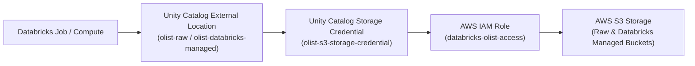

# Security Architecture

## 1. Overview

This document outlines the security architecture for the Olist ecommerce data platform. The platform implements a defense-in-depth model across cloud storage (AWS S3), identity and access management (AWS IAM), and data governance (Databricks Unity Catalog). 

The security posture centers on brokered access: compute jobs never directly hold static AWS storage credentials. Instead, access to underlying cloud storage is mediated through Databricks Unity Catalog storage credentials and external locations backed by scoped IAM roles. All foundational AWS storage, IAM constructs, and Databricks catalog objects are declared and provisioned via Terraform (see [terraform.md](terraform.md)).

## 2. Access Architecture

The data platform delegates data access authorization across five distinct architectural layers:

The authentication and authorization sequence proceeds as follows:
1. **Databricks Job**: The pipeline or workload executes within Databricks compute and references a Unity Catalog governed path or table.
2. **Unity Catalog External Location**: Resolves the target S3 URI (`s3://...`) to a registered Unity Catalog external location (`olist-raw` or `olist-databricks-managed`).
3. **Storage Credential**: The external location references the `olist-s3-storage-credential`, which stores the ARN of the associated AWS IAM role.
4. **AWS IAM Role**: Databricks Unity Catalog assumes the `databricks-olist-access` IAM role via AWS Security Token Service (STS), validating trust policies and external IDs.
5. **AWS S3**: The assumed IAM role's policy governs physical read/write operations against the target S3 bucket and object prefixes.

## 3. S3 Bucket Security

All platform data is persisted across two dedicated AWS S3 buckets in `us-east-1`. Both buckets are managed via Terraform with baseline security configurations enforced at the resource level:

| Bucket Name | Purpose | Public Access Block | Server-Side Encryption | Versioning |
| --- | --- | --- | --- | --- |
| `olist-data-platform-raw` | Raw source data landing | Enabled (all 4 flags) | AES-256 (`SSE-S3`) | Enabled |
| `olist-data-platform-databricks` | Databricks managed storage | Enabled (all 4 flags) | AES-256 (`SSE-S3`) | Enabled |

Security controls enforced on each bucket:
- **Public Access Block**: Configured via `aws_s3_bucket_public_access_block` with all four protections set to `true`:
  - `block_public_acls = true`
  - `block_public_policy = true`
  - `ignore_public_acls = true`
  - `restrict_public_buckets = true`
- **Server-Side Encryption**: Configured via `aws_s3_bucket_server_side_encryption_configuration` enforcing default algorithm `AES256` (`SSE-S3`).
- **Object Versioning**: Configured via `aws_s3_bucket_versioning` with status `Enabled` to prevent accidental data loss and maintain historical object states.

## 4. IAM Configuration

AWS IAM mediates access between Databricks Unity Catalog and AWS S3 storage.

### IAM Role
- **Role Name**: `databricks-olist-access`
- **Managed By**: Terraform ([terraform.md](terraform.md))

### Trust Policy
The role's trust relationship allows the Databricks Unity Catalog service principal to assume the role via STS, protected by a unique external ID:
- **Trusted Principals**:
  - Databricks Unity Catalog master role: `arn:aws:iam::414351767826:role/unity-catalog-prod-UCMasterRole-14S5ZJVKOTYTL`
  - Self-assume principal: `arn:aws:iam::702127848749:role/databricks-olist-access`
- **Action**: `sts:AssumeRole`
- **Condition**: `StringEquals` check enforcing the external identifier `sts:ExternalId = "a9563243-0e5c-404b-9dbb-db588d9a03e2"`.

### Inline Policy
The role currently uses an inline policy (`databricks-olist-s3-access`) granting:
- `s3:*` on `arn:aws:s3:::olist-data-platform-raw`, `arn:aws:s3:::olist-data-platform-raw/*`, `arn:aws:s3:::olist-data-platform-databricks`, and `arn:aws:s3:::olist-data-platform-databricks/*`.
- `sts:AssumeRole` on `arn:aws:iam::702127848749:role/databricks-olist-access`.

> [!WARNING]
> **Known Issue: Overly Permissive IAM Policy**: The current inline policy grants full `s3:*` permissions across both S3 buckets. This violates the principle of least privilege by exposing administrative S3 actions (such as bucket deletion and policy modification) to the role. Narrowing this policy to specific read, write, and metadata actions is a planned remediation item.

## 5. Unity Catalog Governance

Databricks Unity Catalog provides centralized governance across schemas, tables, and raw storage paths.

### Storage Credential
- **Name**: `olist-s3-storage-credential`
- **Backing Mechanism**: AWS IAM role `arn:aws:iam::702127848749:role/databricks-olist-access`
- **Scope**: Platform storage access abstraction managed in Terraform.

### External Locations
External locations bind storage URLs to the storage credential, defining governed filesystem entrypoints:

| External Location Name | Target S3 URL | Storage Credential | Purpose |
| --- | --- | --- | --- |
| `olist-raw` | `s3://olist-data-platform-raw/raw/` | `olist-s3-storage-credential` | Landing area for raw source datasets |
| `olist-databricks-managed` | `s3://olist-data-platform-databricks/catalogue/` | `olist-s3-storage-credential` | Managed storage root for catalog schemas |

### Catalogs and Schemas
The platform defines three environment-segregated catalogs following the medallion architecture:

| Catalog | Environment | Managed Storage Root | Schemas |
| --- | --- | --- | --- |
| `01_ecommerce_dev` | Development | `s3://olist-data-platform-databricks/catalogue/01_ecommerce_dev` | `bronze`, `silver`, `gold` |
| `02_ecommerce_stg` | Staging | `s3://olist-data-platform-databricks/catalogue/02_ecommerce_stg` | `bronze`, `silver`, `gold` |
| `03_ecommerce_prod` | Production | `s3://olist-data-platform-databricks/catalogue/03_ecommerce_prod` | `bronze`, `silver`, `gold` |

### Governance Implementation Status
- **CURRENT**: Storage credentials, external locations, catalogs, and schemas are defined and provisioned via Terraform.
- **PLANNED**: Least-privilege Unity Catalog `GRANT` declarations on storage credentials, external locations, catalogs, and schemas have not yet been defined.

> [!WARNING]
> **Known Issue: Undefined Unity Catalog Privilege Grants**: Unity Catalog permissions are currently unconstrained at the object level within Databricks. Explicit `GRANT` statements establishing granular access controls for jobs, groups, and users remain a planned remediation.

## 6. Credential Management

The platform enforces strict separation between application code, infrastructure configuration, and secrets.

### Secret Handling Rules
1. **Zero Plaintext Secrets in Source Code**: No credentials, API tokens, passwords, or secret keys may be committed to version control.
2. **Environment Variable Authentication**:
   - Databricks provider uses `DATABRICKS_HOST` and `DATABRICKS_TOKEN`.
   - AWS provider uses `AWS_ACCESS_KEY_ID`, `AWS_SECRET_ACCESS_KEY`, and `AWS_DEFAULT_REGION`.
   - Environment variables are sourced locally from an uncommitted `.env` file.
3. **Repository Exclusions**: The root `.gitignore` enforces exclusion of all credential and sensitive state files:
   - `.env` (environment variables and API tokens)
   - `/secrets/` (local secret files and certificates)
   - `*.tfvars` and `*.tfvars.json` (variable definitions containing potential secrets)
   - `*.tfstate` and `*.tfstate.*` (Terraform state files)
   - `**/.terraform/*` (provider binaries and local backend state)

## 7. Terraform State Security

### Current State
Terraform infrastructure state is stored locally within the `terraform/` directory (`terraform.tfstate`). The file is explicitly excluded from version control via `.gitignore`.

### State Security Considerations
Terraform state contains sensitive infrastructure metadata, including resource IDs, ARNs, and full policy declarations. 

> [!WARNING]
> **Known Issue: Local Terraform State**: Local state storage presents operational and security risks:
> - Lack of encryption-at-rest independent of the local operating system.
> - Absence of automated state locking, risking state corruption during concurrent executions.
> - Lack of centralized audit logging for state reads and modifications.
>
> Migration to an encrypted, remote state backend is required prior to multi-engineer deployment or CI/CD execution.

## 8. Known Gaps and Planned Remediation

The platform has three identified security gaps scheduled for remediation:

| Security Gap | Severity | Current Status | Planned Remediation |
| --- | --- | --- | --- |
| **Overly Permissive IAM Policy** | High | Inline policy grants wildcard `s3:*` on both platform buckets. | Replace `s3:*` with explicit least-privilege actions: `s3:GetObject`, `s3:PutObject`, `s3:DeleteObject`, `s3:ListBucket`, `s3:GetBucketLocation`. |
| **Missing Unity Catalog Privilege Grants** | Medium | Storage credentials and external locations lack explicit least-privilege `GRANT` statements. | Define and apply granular Unity Catalog privilege grants (`READ FILES`, `WRITE FILES`, `USE CATALOG`, `USE SCHEMA`) per service identity. |
| **Local Terraform State** | Medium | State is stored locally in `terraform.tfstate`, tracked outside remote access controls. | Migrate backend to an S3 remote backend with server-side KMS encryption, versioning, access logging, and DynamoDB state locking. |

## 9. Security Rules

The following security invariants must be preserved across all future platform changes:

1. **No Direct Storage Credentials on Compute**: Compute clusters and jobs must authenticate to S3 strictly via Unity Catalog external locations and IAM role assumption. Static AWS access keys must never be installed on compute resources.
2. **Mandatory S3 Access Blocking**: Public access block configurations (`block_public_acls`, `block_public_policy`, `ignore_public_acls`, `restrict_public_buckets`) must remain enabled on all storage buckets.
3. **Mandatory Encryption-at-Rest**: All S3 buckets must enforce server-side encryption (`AES256` or AWS KMS) on all stored objects.
4. **Strict Repository Hygiene**: Never commit `.env`, `/secrets/`, `*.tfstate`, or `*.tfvars` files. Pre-commit checks and `.gitignore` rules must be maintained.
5. **Environment Path Isolation**: Managed storage paths must remain strictly partitioned by catalog (`.../catalogue/01_ecommerce_dev`, `.../catalogue/02_ecommerce_stg`, `.../catalogue/03_ecommerce_prod`).
6. **Infrastructure as Code Enforcement**: All IAM roles, policies, S3 configurations, and Unity Catalog storage integrations must be provisioned and modified exclusively through Terraform.
